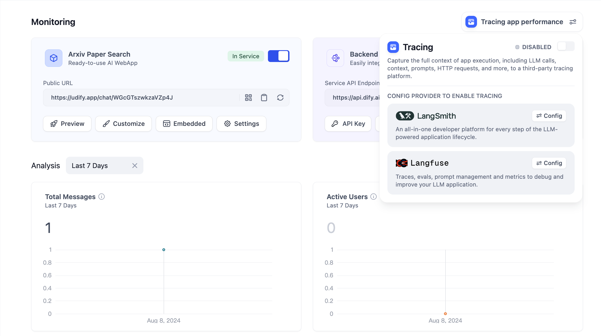
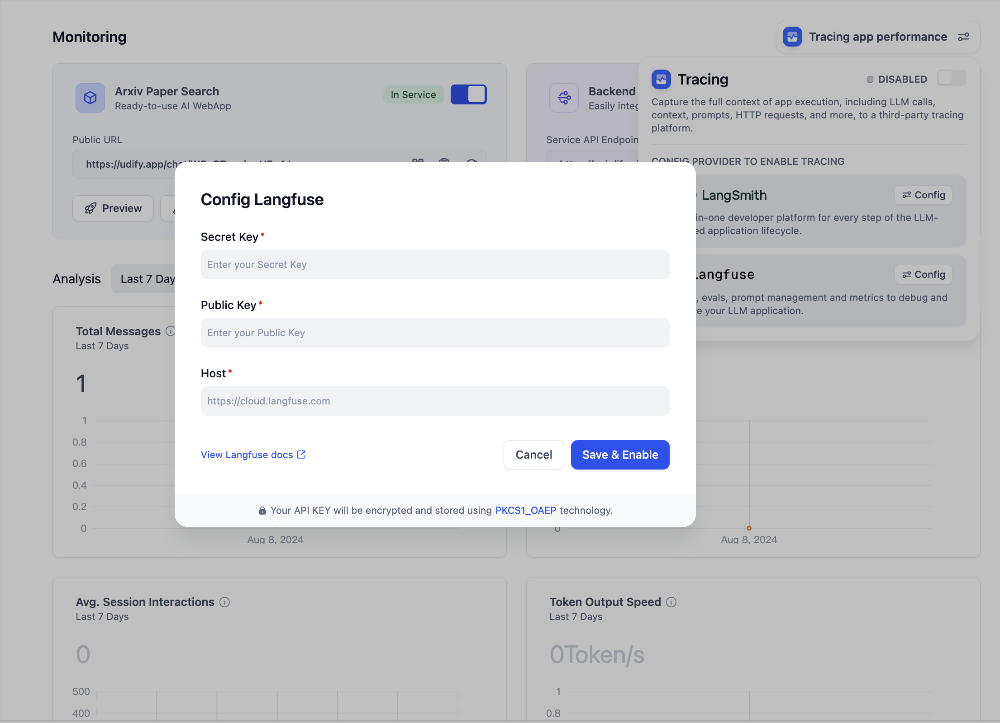
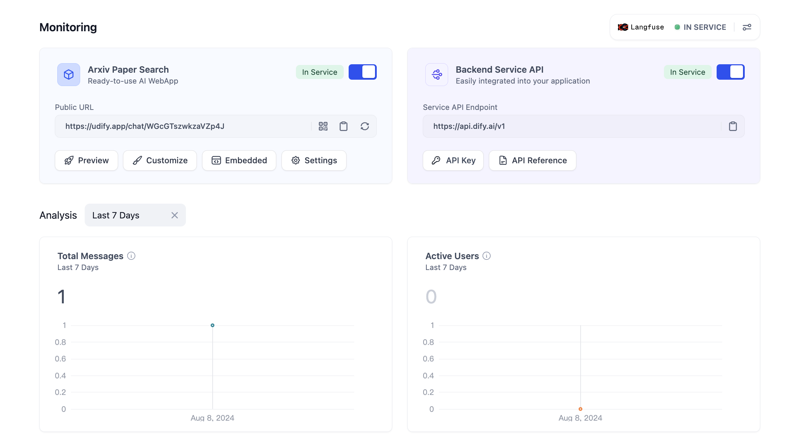
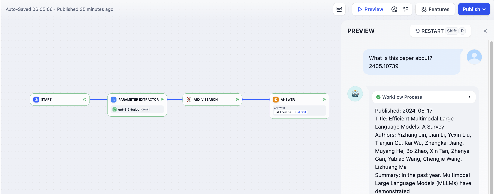
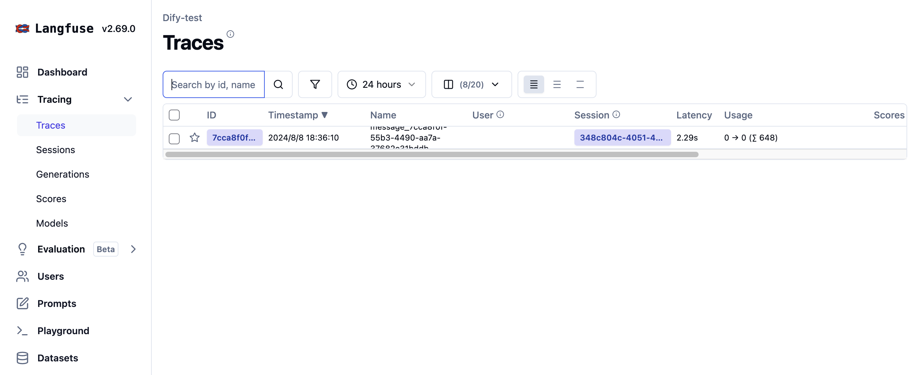

### Langfuseとは

LangfuseはLLMアプリケーションの開発者がデバッグ、分析、イテレーション等を使用してアプリケーションのパフォーマンスを向上させるためのツールです。

<Tip>
Langfuseの公式サイト：[https://langfuse.com/](https://langfuse.com/)
</Tip>

***

### Langfuseの設定方法

1. まず、[公式サイト](https://langfuse.com/) に登録し、Langfuseにログインします。  
2. ログイン後、Langfuseでプロジェクトを作成します。ホームページで **New** をクリックして、自分のプロジェクトを作成します。この **プロジェクト** はDify内の **アプリケーション** とデータ監視に関連付けられます。  

<Frame caption="在 Langfuse 内创建项目">
  
</Frame>

プロジェクトの名前を付けます。

<Frame caption="在 Langfuse 内创建项目">
  
</Frame>

3. プロジェクト認証情報の作成のために、左のサイドバーでプロジェクト **設定** をクリックする。

<Frame caption="创建一个项目 API 凭据">
  
</Frame>

**Create API Key**をクリックし，新たな認証情報を作ります。

<Frame caption="创建一个项目 API 凭据">
  
</Frame>

**Secret Key** と **Public Key，Host** をコピーし、保存します。

<Frame caption="获取 API Key 配置">
  
</Frame>

4. Dify アプリの中に Langfuse を設定するために、監視用のアプリのサイトメニューの**監視**ボタンをクリックし，**設定**をクリックします。

<Frame caption="配置 Langfuse">
  
</Frame>

それから，Langfuse から作った **Secret Key, Public Key** と **Host** を**設定**の中に貼り付け、保存します。

<Frame caption="Langfuseを設定します">
  
</Frame>

保存に成功すると、現在のページで監視状態を見ることができます。

<Frame caption="監視状態を見る">
  
</Frame>

***

### Langfuse ページで監視データをチェックします

設定した後， Difyのアプリや生産データは Langfuse の中にチェクをできます。

<Frame caption="Difyでのアプリの調整">
  
</Frame>

<Frame caption="Langfuseでアプリデータを見る">
  
</Frame>

<Frame caption="Langfuseでアプリデータを見る">
  
</Frame>

### 監視データのリスト

#### ワークフローとチャットフローの情報を追跡

**ワークフローとチャットフローの追跡**

| Workflow                                 | LangFuse Trace          |
| ---------------------------------------- | ----------------------- |
| workflow\_app\_log\_id/workflow\_run\_id | id                      |
| user\_session\_id                        | user\_id                |
| workflow\_{id}                           | name                    |
| start\_time                              | start\_time             |
| end\_time                                | end\_time               |
| inputs                                   | input                   |
| outputs                                  | output                  |
| Model token consumption                  | usage                   |
| metadata                                 | metadata                |
| error                                    | level                   |
| error                                    | status\_message         |
| \[workflow]                              | tags                    |
| \["message", conversation\_mode]         | session\_id             |
| conversion\_id                           | parent\_observation\_id |

**Workflow Trace Info**

- workflow\_id - ワークフローのユニークID
- conversation\_id - 会話ID
- workflow\_run\_id - このランタイムのワークフローID
- tenant\_id - テナントID
- elapsed\_time - このランタイムの経過時間
- status - ランタイムのステータス
- version - ワークフローのバージョン
- total\_tokens - このランタイムで使用されたトークンの合計
- file\_list - 処理されたファイルのリスト
- triggered\_from - このランタイムをトリガしたソース
- workflow\_run\_inputs - このワークフローの入力
- workflow\_run\_outputs - このワークフローの出力
- error - エラーメッセージ
- query - ランタイムで使用されるクエリ
- workflow\_app\_log\_id - ワークフローアプリケーションログID
- message\_id - 関連するメッセージID
- start\_time - このランタイムの開始時刻
- end\_time - このランタイムの終了時刻
- workflow node executions - ワークフローノードのランタイム情報
- Metadata
  - workflow\_id - ワークフローのユニークID
  - conversation\_id - 会話ID
  - workflow\_run\_id - このランタイムのワークフローID
  - tenant\_id - テナントID
  - elapsed\_time - このランタイムの経過時間
  - status - 運用状態
  - version - ワークフローのバージョン
  - total\_tokens - このランタイムで使用されたトークンの合計
  - file\_list - 処理されたファイルのリスト
  - triggered\_from - このランタイムをトリガしたソース

#### Message Trace 情報

**LLM会話を追跡するため**

| Message                          | LangFuse Generation/Trace |
| -------------------------------- | ------------------------- |
| message\_id                      | id                        |
| user\_session\_id                | user\_id                  |
| message\_{id}                    | name                      |
| start\_time                      | start\_time               |
| end\_time                        | end\_time                 |
| inputs                           | input                     |
| outputs                          | output                    |
| Model token consumption          | usage                     |
| metadata                         | metadata                  |
| error                            | level                     |
| error                            | status\_message           |
| \["message", conversation\_mode] | tags                      |
| conversation\_id                 | session\_id               |
| conversion\_id                   | parent\_observation\_id   |

**Message Trace Info**

- message\_id - メッセージID
- message\_data - メッセージデータ
- user\_session\_id - ユーザーのセッションID
- conversation\_model - 会話モデル
- message\_tokens - メッセージトークン
- answer\_tokens - 回答トークン
- total\_tokens - メッセージと回答のトータルトークン
- error - エラーメッセージ
- inputs - 入力データ
- outputs - 出力データ
- file\_list - 処理されたファイルのリスト
- start\_time - 開始時刻
- end\_time - 終了時刻
- message\_file\_data - 関連ファイルデータのメッセージ
- conversation\_mode - 会話モード
- Metadata
  - conversation\_id - 会話ID
  - ls\_provider - モデルプロバイダ
  - ls\_model\_name - モデルID
  - status - メッセージステータス
  - from\_end\_user\_id - 送信ユーザーID
  - from\_account\_id - 送信アカウントID
  - agent\_based - エージェントベースか
  - workflow\_run\_id - このランタイムのワークフローID
  - from\_source - メッセージのソース
  - message\_id - メッセージID

#### Moderation Trace 情報

**会話モデレーションを追跡するため**

| Moderation    | LangFuse Generation/Trace |
| ------------- | ------------------------- |
| user\_id      | user\_id                  |
| moderation    | name                      |
| start\_time   | start\_time               |
| end\_time     | end\_time                 |
| inputs        | input                     |
| outputs       | output                    |
| metadata      | metadata                  |
| \[moderation] | tags                      |
| message\_id   | parent\_observation\_id   |

**Message Trace Info**

- message\_id - メッセージID
- user\_id - ユーザーID
- workflow\_app\_log\_id - ワークフローアプリケーションログID
- inputs - レビュー用の入力データ
- message\_data - メッセージデータ
- flagged - 注目対象としてフラグが立てられているか
- action - 実行すべき具体的なアクション
- preset\_response - 事前設定の応答
- start\_time - レビューの開始時刻
- end\_time - レビューの終了時刻
- Metadata
  - message\_id - メッセージID
  - action - 実行すべき具体的なアクション
  - preset\_response - 事前設定の応答

#### 提案された質問トレース情報

**提案された質問を追跡するため**

| Suggested Question     | LangFuse Generation/Trace |
| ---------------------- | ------------------------- |
| user\_id               | user\_id                  |
| suggested\_question    | name                      |
| start\_time            | start\_time               |
| end\_time              | end\_time                 |
| inputs                 | input                     |
| outputs                | output                    |
| metadata               | metadata                  |
| \[suggested\_question] | tags                      |
| message\_id            | parent\_observation\_id   |

**Message Trace Info**

* message\_id - メッセージID
* message\_data - メッセージデータ
* inputs - 入力データ
* outputs - 出力データ
* start\_time - 開始時刻
* end\_time - 終了時刻
* total\_tokens - トータルトークン
* status - メッセージの状態
* error - エラーメッセージ
* from_account_id - 送信元アカウントのID
* agent_based - エージェントベースであるかどうか
* from_source - メッセージの発信元
* model_provider - モデルのプロバイダー
* model_id - モデルのID
* suggested_question - 提案された質問
* level - ステータスのレベル
* status_message - ステータスメッセージ
* Metadata
  * message_id - メッセージのID
  * ls_provider - モデルのプロバイダー
  * ls_model_name - モデルの名前
  * status - メッセージの状態
  * from_end_user_id - 送信元ユーザーのID
  * from_account_id - 送信元アカウントのID
  * workflow_run_id - このランタイムにおけるワークフローのID
  * from_source - メッセージの発信元

#### Dataset Retrieval Trace 情報

**ナレッジベースの取得を追跡するために使用**

| データセットの取得 | LangFuse生成/トレース |
| ----------------- | ------------------- |
| user_id           | user_id             |
| dataset_retrieval | name                |
| start_time        | start_time          |
| end_time          | end_time            |
| inputs            | input               |
| outputs           | output              |
| metadata          | metadata            |
| \[dataset_retrieval] | tags              |
| message_id        | parent_observation_id |

**Dataset Retrieval Trace Info**

* message_id - メッセージのID
* inputs - 入力メッセージ
* documents - ドキュメントデータ
* start_time - 開始時間
* end_time - 終了時間
* message_data - 消息数据
* Metadata
  * message_id - メッセージのID
  * ls_provider - モデルのプロバイダー
  * ls_model_name - モデルの名前
  * status - モデルの状態
  * from_end_user_id - 送信元ユーザーのID
  * from_account_id - 送信元アカウントのID
  * agent_based - エージェントベースであるかどうか
  * workflow_run_id - このランタイムにおけるワークフローのID
  * from_source - メッセージの発信元

#### Tool Trace 情報

**ツールの呼び出しを追跡するために使用**

| ツール               | LangFuse生成/トレース |
| ------------------- | ------------------- |
| user_id             | user_id             |
| tool_name           | name                |
| start_time          | start_time          |
| end_time            | end_time            |
| inputs              | input               |
| outputs             | output              |
| metadata            | metadata            |
| \["tool", tool_name] | tags              |
| message_id          | parent_observation_id |

**Tool Trace Info**

* message_id - メッセージのID
* tool_name - ツール名
* start_time - 開始時間
* end_time - 終了時間
* tool_inputs - ツールの入力
* tool_outputs - ツールの出力
* error - エラーメッセージ（存在する場合）
* inputs - メッセージの入力
* outputs - メッセージの出力
* tool_config - ツールの構成
* tool_parameters - ツールのパラメータ
* file_url - 関連ファイルのURL
* Metadata
  * message_id - メッセージのID
  * tool_name - ツール名
  * tool_inputs - ツールの入力
  * tool_outputs - ツールの出力
  * tool_config - ツールの構成
  * error - エラーメッセージ
  * tool_parameters - ツールのパラメータ
  * message_file_id - メッセージファイルのID
  * created_by_role - 作成者の役割
  * created_user_id - 作成ユーザーのID

#### Generate Name Trace 情報

**会話タイトル生成の追跡に使用**

| Generate Name     | LangFuse Generation/Trace |
| ----------------- | ------------------- |
| user_id           | user_id             |
| generate_name     | name                |
| start_time        | start_time          |
| end_time          | end_time            |
| inputs            | input               |
| outputs           | output              |
| metadata          | metadata            |
| \[generate_name]   | tags                |

**Generate Name Trace Info**

* conversation_id - 会話のID
* inputs - 入力データ
* outputs - 生成されたセッション名
* start_time - 開始時間
* end_time - 終了時間
* tenant\_id - テナントID
* Metadata
  * conversation_id - 会話のID
  * tenant\_id - テナントID
